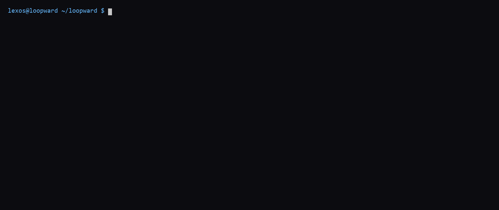

# loopward

**A reliability layer for multi-agent LLM systems.** Most agent frameworks give
you *capability* — more tools, more autonomy. `loopward` gives you the thing
that makes autonomy safe to ship: **reliability**, enforced structurally rather
than by convention. Anti-loop. Human stop-gates.
A full audit trail of every decision and every dollar.

> Runs **offline with zero API keys** out of the box (a deterministic `fake`
> provider powers the demo and the whole test suite).

---

## The problem

Turn an LLM loose on a task and three failure modes show up fast:

1. **It loops.** Same broken approach, retried forever, burning tokens.
2. **It acts unsupervised.** No checkpoint before the irreversible step.
3. **It's a black box.** No record of what it decided, why, or what it cost.

`loopward` is the small, boring layer that fixes exactly those three.

## The three guarantees

| Guarantee | What it does | Module |
|---|---|---|
| **Anti-loop** | After `N` failed attempts on a subtask, refuse another naive retry and force a **class-jump** to a different strategy. | `engine/anti_loop.py` |
| **Stop-gate** | Pause for human approval between critical phases (`interactive` / `auto` for CI / `deny`). Every decision is logged. | `engine/stop_gate.py` |
| **Audit** | Per-run trail: every attempt, gate, token, and cost → `runs/<timestamp>/audit.{json,md}`. | `engine/audit.py` |

The demo task is **automated code review**: a Reviewer agent finds issues, a
Verifier agent re-checks them (probe before you trust), and the orchestrator runs
both under anti-loop + stop-gate + audit.

### Enforced structurally, not by convention

The stop-gate is an **object-capability**. `Verifier.verify(findings, approval)`
requires an `Approval`, and genuineness is checked by **identity membership** in
a private registry that **only `StopGate.request()` populates** (on APPROVE) —
not by `isinstance`. So every forgery path is closed within the threat model:

- calling `verify()` with no approval → `TypeError` (missing argument);
- a hand-built `Approval(...)`, a **subclass**, or an `object.__new__(Approval)`
  instance → rejected (not in the registry / subclassing raises);
- minting a valid `Approval` would require reaching into module-private state,
  which is out of scope — as it is for any capability.

The anti-loop's **hard bound is the orchestrator's bounded loop** (it advances
strategies a finite number of times and terminates in `EXHAUSTED`, never spins).
On top of that, the `AttemptOutcome` verdict is a matching tamper-evident token
that only `AttemptTracker.record_failure()` mints.

The supported entry point is `loopward.Orchestrator`; the raw agents are not part
of the public API. [`tests/test_no_evasion.py`](tests/test_no_evasion.py) is the
proof — it re-runs the forgery attempts (subclass, `object.__new__`, hand-built,
missing) and asserts each is rejected, and that only a real gate-minted approval
proceeds.

## Benchmark

The number that matters is **categorical, not a ratio**. On a code-review task that never converges (the model never emits parseable findings), `loopward` has a **hard, deterministic ceiling**:

- it stops on its own after exactly **6 LLM calls / 819 tokens** and returns `EXHAUSTED` — measured, and asserted at runtime against `MAX_ATTEMPTS × len(STRATEGIES)` (`3 × 2 = 6`), so a core change breaks the benchmark loudly instead of reporting a false number;
- a **naive retry loop has no ceiling at all** (`naive_self_terminates: false`) — only a human or a timeout stops it.

The token *ratio* below depends on **when a human kills the naive loop** (`K`), so it is labeled as such — it is illustrative, not the headline:

| K (human kills naive loop at) | naive calls | naive tokens | loopward | token ratio |
|---|---|---|---|---|
| 10  | 10  | 1160  | 6 / 819 | 1.42× |
| 25  | 25  | 2900  | 6 / 819 | 3.54× |
| 50  | 50  | 5800  | 6 / 819 | 7.08× |
| 100 | 100 | 11600 | 6 / 819 | 14.16× |

**Honest caveat:** the absolute token counts are tiny (819) because this is a single small task on the deterministic `fake` provider. The benchmark demonstrates the *mechanism* — unbounded → bounded — not a large bill. It scales with task size × the number of stuck subtasks in a real multi-agent run.

Reproduce:

```bash
python benchmarks/bench_antiloop.py          # human-readable table
python benchmarks/bench_antiloop.py --json   # machine-readable measurements
```

## Quickstart (no API key)

```bash
pip install -e .
loopward-demo
```

You'll watch the reviewer's first strategy fail to produce parseable findings
three times, **class-jump** to a stricter strategy that works, pass the
stop-gate, verify, and write an audit trail:

```
[class_jump] switching review strategy after 3 failures on 'concise'
[gate] phase 'verify' [auto] -> approve (auto-approved)
[result] 2 confirmed finding(s), blocking
--- audit trail written to: runs/20260529T163401Z ---
```

Review your own diff:

```bash
loopward path/to/change.patch --gate auto          # offline fake provider
loopward path/to/change.patch --provider deepseek  # real LLM (needs key)
```

## Multi-LLM

One client, swappable providers — the model is **always configurable, never
hardcoded**:

```bash
loopward diff.patch --provider deepseek --model deepseek-v4-pro
loopward diff.patch --provider claude   --model claude-sonnet-4-6
loopward diff.patch --provider fake                     # offline, default
```

Keys are read from the environment only (`DEEPSEEK_API_KEY`, `ANTHROPIC_API_KEY`
— see `.env.example`). The real SDKs are optional installs (`pip install -e .[deepseek]`
or `.[claude]`).

## Architecture

```
            ┌──────────────────────────────────────────────┐
            │                Orchestrator                   │
            │   (the only component that calls agents)      │
            └───────────────┬───────────────┬──────────────┘
              review phase   │               │  verify phase
                             ▼               ▼
                      ┌────────────┐   ┌────────────┐
                      │  Reviewer  │   │  Verifier  │
                      └─────┬──────┘   └─────┬──────┘
                            │ parse fails?    │
            ┌───────────────▼──────┐   ┌──────▼───────────┐
            │  AttemptTracker      │   │   StopGate       │
            │  (3 → class-jump)    │   │ (human approval) │
            └───────────────┬──────┘   └──────┬───────────┘
                            └──────┬───────────┘
                                   ▼
                             ┌──────────┐     ┌──────────────┐
                             │ LLMClient│     │   AuditLog   │
                             │ provider │     │ runs/<ts>/   │
                             └──────────┘     └──────────────┘
```

Agents never call each other — the orchestrator coordinates. Every collaborator
is injected, so the whole flow is testable offline.

## Demo



## Tests

```bash
pytest                 # all green, offline, no secrets
pytest tests/test_no_evasion.py   # the gate cannot be bypassed (structural proof)
ruff check .
```

## License

MIT — see [LICENSE](LICENSE).
